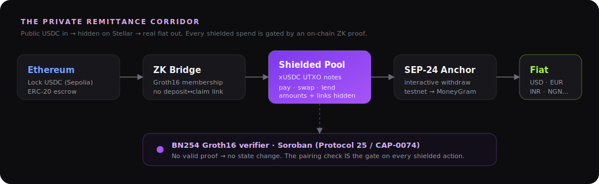
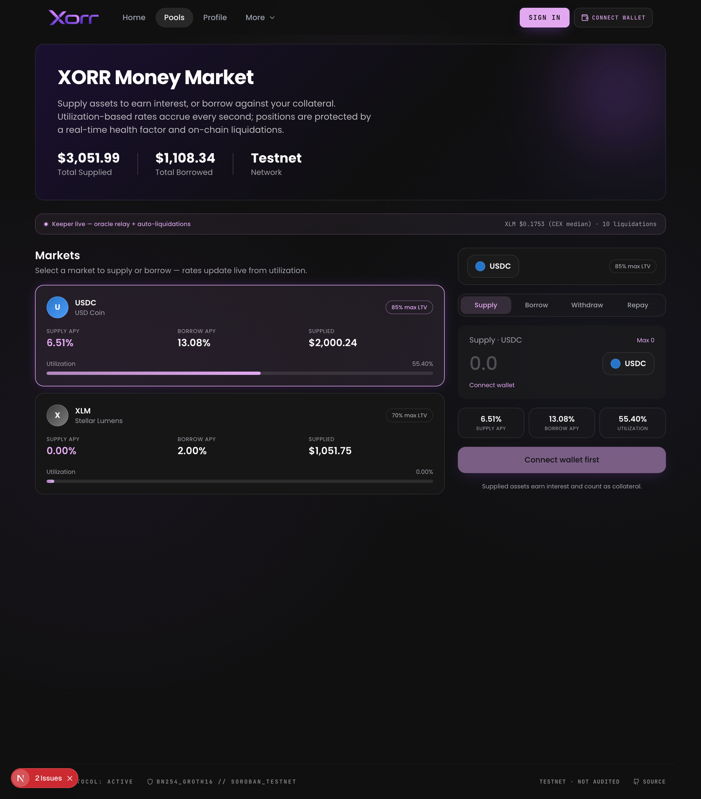
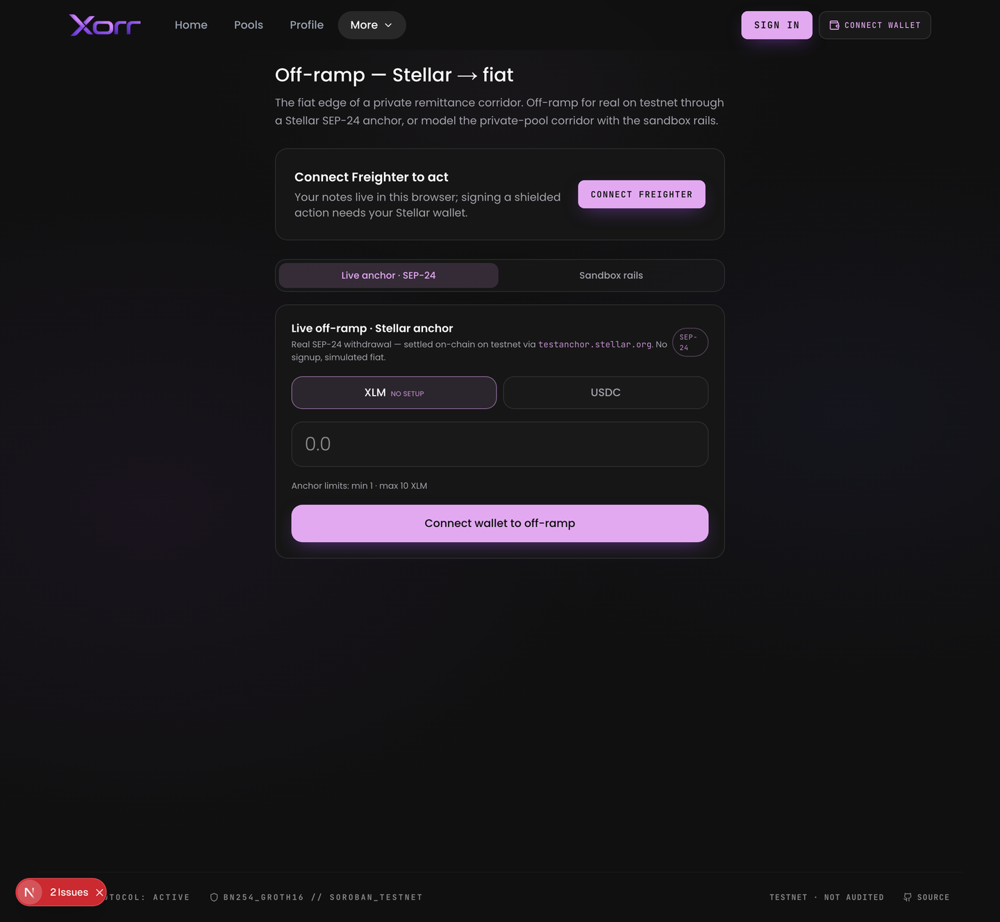
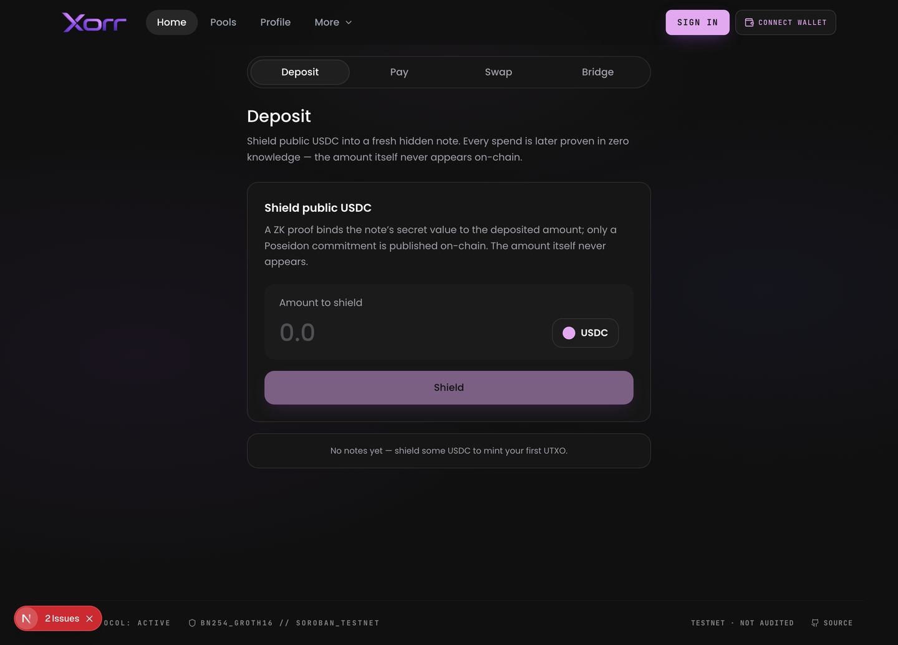

<p align="center">
  
</p>

<h3 align="center">Private-by-default money on Stellar</h3>

<p align="center">
  Shield USDC into unlinkable ZK notes · pay by email · bridge from Ethereum · earn in a money market ·<br/>
  <b>off-ramp to real fiat through a Stellar anchor</b> — every shielded spend verified on-chain by a BN254 Groth16 contract on Soroban.
</p>

<p align="center">
  
  
  
  
  
</p>

<p align="center">
  
</p>

> **Private, _not_ anonymous.** Amounts, senders, receivers and balances are hidden on-chain — but a holder can disclose a **view key** to an auditor, or **prove reserves clear a threshold** without revealing balances. Built for the **Real-World ZK on Stellar** hackathon. The ZK is load-bearing: no valid Groth16 proof → no state change, enforced by a native pairing check using Stellar's **Protocol 25 / CAP-0074** BN254 host functions.

---

## What it looks like

<table>
  <tr>
    <td width="50%" valign="top">
      <br/>
      <sub><b>Money market</b> — supply/borrow USDC &amp; XLM, utilization rates, live oracle + auto-liquidations.</sub>
    </td>
    <td width="50%" valign="top">
      <br/>
      <sub><b>Off-ramp</b> — a <b>real SEP-24 withdrawal</b> settled on-chain via a Stellar anchor.</sub>
    </td>
  </tr>
  <tr>
    <td colspan="2" align="center">
      <br/>
      <sub><b>Deposit</b> — shield public USDC into an unlinkable ZK note; only a Poseidon commitment touches the chain.</sub>
    </td>
  </tr>
</table>

## Features

- **Shielded USDC (UTXO notes).** Deposit public USDC → a hidden note; spend it later with a Groth16 proof. Amounts and the spender are hidden on-chain.
- **Pay by email or social handle.** Recipients sign in with Google / X / GitHub / email; a custodial Stellar wallet is generated via **Privy** (keys in a TEE) and a **Resend** email lets them claim — no seed phrase, no extension.
- **ETH → Stellar ZK bridge** into private **xUSDC**: lock on Ethereum, claim on Stellar with a Groth16 proof — no on-chain link between deposit and claim.
- **Money market** (Compound-style): supply/borrow USDC &amp; XLM, per-second utilization interest, per-asset collateral factor, real-time health factor, a **live CEX-oracle keeper** and **automatic on-chain liquidations**.
- **Swaps** — public (constant-product AMM + a multi-pool factory, incl. confidential pools) and **private**: `private_swap` spends a shielded note via a Groth16 proof and routes it through the AMM, so a trade has **no on-chain link** to your identity or balance.
- **Real fiat off-ramp (SEP-24).** A genuine on-chain testnet withdrawal through a Stellar **anchor** (SEP-10 auth → interactive withdraw → on-chain payment → fiat settlement). Defaults to the SDF test anchor (no signup); production is a one-env-var swap to **MoneyGram / Kado**.
- **Proof of Solvency** — prove a shielded balance is **≥ a threshold** with the amount hidden (confidential proof-of-funds).
- **Compliance** — selective disclosure of a note to an auditor via a view key, without revealing the spend key.

---

## ✅ Proven on-chain (Stellar testnet)

Real transactions where a Groth16 proof was generated off-chain (snarkjs) and **verified on-chain** by our Soroban verifier, or a real SEP-24 settlement landed. Click through:

| What | Evidence |
|------|----------|
| **Shielded deposit** — proof verified, pool state changed (`total_shielded 0 → 0.1 USDC`, `next_leaf 0 → 1`) | [tx `99ac87b1…`](https://stellar.expert/explorer/testnet/tx/99ac87b17b11ed0dbac33d627827640df8b0c15011dee4889deed3b494d1a93b) |
| **Real off-ramp (SEP-24)** — 10 XLM → 9 USD, status `completed`; on-chain payment to the anchor + simulated fiat settlement | [tx `64064e4e…`](https://stellar.expert/explorer/testnet/tx/64064e4eb81a830f5dca8b7933d8fba43ae549c9b908e8289050f6c85ab8cdf6) |
| **Proof of Solvency** — proves *balance ≥ 0.05 USDC* with the amount hidden; verifier returns `true` | [tx `0dea9e49…`](https://stellar.expert/explorer/testnet/tx/0dea9e498d4aa995c53c8dbd3f394565ab17011a3c676dbe9ebdf12c92aae99c) |
| **On-chain swap** — seeded AMM, 10 USDC → 45.33 XLM | [tx `b58d466f…`](https://stellar.expert/explorer/testnet/tx/b58d466fb276769366f2378dee5144b147e4279447ce419a83fdb681da9f1b41) |
| Verifying keys installed (Deposit / Transfer / Withdraw) | [`ecc0218c`](https://stellar.expert/explorer/testnet/tx/ecc0218c8601177f1b85c98b6aa8c286cc5b959da2499931fa80dba8c4e18b43) · [`183e555c`](https://stellar.expert/explorer/testnet/tx/183e555c81ae53e90c8be07c5916d3fb62579696f6d4c3c114b66a496303fafc) · [`9e1653ce`](https://stellar.expert/explorer/testnet/tx/9e1653cedcfa79f330d2116ebd023487567c55a47571560c6ac38c62402c8a03) |

If a proof were invalid the pool returns `Error::InvalidProof` and nothing changes — so the state transition **is** the proof of verification.

## Live deployment (testnet)

| Contract | ID |
|----------|----|
| Privacy pool — deposit/transfer/withdraw/solvency **+ `private_swap`**, VKs installed | `CAN7XXQLMJCDLUTUEPEWMCWNOJQLQYYCUBWONNSSTVFWNN6NMGG2HCAE` |
| ETH → Stellar **ZK bridge** | `CBY2HZYOL3RICABWYDYYL7QHHJ2DDOGMAYMAW4WGQ2CC2RESARIADKMM` |
| **Money market** (supply/borrow + liquidations) | `CAA65A76UFS5Q6NUEECGV232SDQ7HST5PSAWB6Y4FOZWA5TVZFJIOCL4` |
| BN254 Groth16 verifier (generic, stateless) | `CC46C65SFSA2QNNGZRRXAYTDB4S6V4MB52MGDBZC5A6NI3QG5H4L2FO2` |
| Test USDC (Stellar Asset Contract) | `CAD7OEAESCGR5XV2BA2AHZCWM6EVJEYBYOOCA3D3ZG4TCOBWWHMZVFIV` |
| **AMM** (constant-product swaps, USDC↔XLM) | `CD6W7BAZ7DBZB7ZAKLNCSQYQOAFKV36PGZZEGZAUSG3QIFYR3356VL4N` |
| **Pool factory** (multi-pool + confidential pools) | `CADU5RQBNEDPIRLGWOEC62EIGAV6V54KGITMGJ52R2ODT6EUBM66NP55` |
| **SEP-24 off-ramp anchor** (real on-chain withdrawal) | `testanchor.stellar.org` |

## The real SEP-24 off-ramp

The fiat edge of the corridor is a **genuine on-chain testnet off-ramp**, not a mock. It runs the full [SEP-24](https://developers.stellar.org/docs/learn/fundamentals/anchors) lifecycle against a real Stellar anchor:

```
authenticate (SEP-10)    → JWT
withdraw/interactive      → anchor's hosted form (KYC + bank details)
poll → pending_user_transfer_start   → anchor returns its receive account + memo
on-chain payment (Horizon)           → real Stellar tx to the anchor
poll → completed                      → anchor settles the fiat payout
```

It defaults to the **SDF reference test anchor** (`testanchor.stellar.org`) — real SEP-10/SEP-24 on Stellar testnet with simulated "fake banking" rails, so it works with **no signup, no KYC, no real money**. Because it's standards-based, going to production is a single env var (`NEXT_PUBLIC_ANCHOR_DOMAIN`) pointed at **MoneyGram Access** or **Kado** — both implement the same SEP-24 flow. Client lives in [`xorr-core/lib/sep24.ts`](./xorr-core/lib/sep24.ts).

## How the ZK works

```
deposit   : prove a commitment opens to a public amount, inserted old_root → new_root   (amount public, owner hidden)
transfer  : prove 2 inputs ∈ tree, nullifiers valid, value conserved, 2 outputs inserted (amounts + link hidden)
withdraw  : prove 1 input ∈ tree, nullifier valid, in == amount + change, recipient bound
solvency  : prove ownership of a note ∈ tree worth ≥ threshold, WITHOUT revealing the amount
```

**The contract never hashes.** All Poseidon / Merkle work lives in the Circom circuits; the Soroban contracts only (1) verify a Groth16 proof via `env.crypto().bn254().pairing_check`, and (2) keep the books — Merkle root, nullifier set, value accounting, token custody.

Note scheme (UTXO):

```
pk         = Poseidon(sk)
commitment = Poseidon(amount, pk, blinding)   # stored in the Merkle tree
nullifier  = Poseidon(commitment, sk)         # revealed on spend, unlinkable
```

## 🌟 Novel feature: Proof of Solvency

A **confidential "proof of funds"** for real-world finance — an OTC desk, loan collateral, or an accredited-investor gate. The holder proves they control a shielded note worth **at least a threshold** without revealing the amount or which note. Public signals are only `[root, threshold, nullifier]`; the amount stays inside the circuit.

- Circuit: [`circuits/src/solvency.circom`](./xorr-stellar-contracts/circuits/src/solvency.circom) — reuses the pool's note/Merkle templates, adds a `GreaterEqThan(amount, threshold)` constraint.
- On-chain: calls the **existing generic verifier directly** — no pool change, no extra contract. Verified live in [tx `0dea9e49`](https://stellar.expert/explorer/testnet/tx/0dea9e498d4aa995c53c8dbd3f394565ab17011a3c676dbe9ebdf12c92aae99c).

## Repo layout

| Project | What | Stack |
|---------|------|-------|
| [`xorr-core`](./xorr-core) | The shielded wallet: deposit, pay, swap, bridge, **money market**, **SEP-24 off-ramp**, compliance, solvency, faucet. | Next.js · Freighter · wagmi · snarkjs |
| [`xorr-stellar-contracts`](./xorr-stellar-contracts) | On-chain side — Soroban contracts (BN254 verifier, privacy pool, bridge, AMM, factory, lending) + Circom circuits. | Rust/Soroban · Circom · snarkjs |
| [`xorr-landing`](./xorr-landing) | Marketing site — the story, bento features, smooth-scroll product menu. | Next.js · Tailwind · Framer Motion |

## Quickstart

```bash
# The app — already wired to the live testnet deployment (xorr-core/.env.local)
cd xorr-core && npm install --legacy-peer-deps && npm run dev   # http://localhost:3000
#    npm run typecheck → tsc --noEmit (clean)

# Reproduce the ZK pipeline from scratch (needs circom 2.x + stellar CLI)
cd xorr-stellar-contracts/circuits && pnpm install && pnpm build   # circuits + trusted setup
cd .. && scripts/deploy_xorr.sh                                    # deploy under your key + set VKs
```

The wallet needs the **Freighter** extension (Stellar). Proving artifacts are committed under [`xorr-core/public/circuits/`](./xorr-core/public/circuits) so in-browser proving works out of the box. To off-ramp: open **/offramp → Live anchor · SEP-24**, connect Freighter (testnet), pick **XLM** (no setup), and withdraw **1–10** through the anchor.

## What we built vs. what we reused (honest attribution)

This project is a **mix** — assembled from existing work and substantially extended during the hackathon.

**Reused as a base (credit to the original authors):** the wallet/landing **UI shells** from the `nickthelegend/xorr-*` repos; the **ShieldedBridge** Soroban contracts + core Circom circuits (`deposit`/`transfer`/`withdraw`/`disclose`) and the wallet's crypto lib from the `stellar-privacy` reference implementation.

**Built / done by us for this submission:**
- A **fresh, reproducible deployment under our own keys** (verifier + pool + USDC + bridge, VKs installed) — see the tx evidence above.
- The **money market** end-to-end: the Compound-style lending contract, the live CEX-oracle + auto-liquidation keeper, and the in-app supply/borrow UI.
- The **real SEP-24 off-ramp** ([`lib/sep24.ts`](./xorr-core/lib/sep24.ts) + the off-ramp flow): SEP-10 auth, interactive withdraw, the on-chain anchor payment, and status polling — verified end-to-end on testnet.
- The **Proof-of-Solvency** feature: [`solvency.circom`](./xorr-stellar-contracts/circuits/src/solvency.circom), its trusted-setup wiring, the prover + on-chain verifier call, and the Solvency app page.
- Porting the wallet lib into **Next.js** (`xorr-core`), the private/public swaps UX, and a clean `tsc` typecheck across the app.

Nothing here claims the underlying ShieldedBridge cryptography as original work — our contribution is the Stellar deployment we own, the money market, the real SEP-24 off-ramp, the solvency feature, and the Next.js app.

---

_Stellar · Protocol 25 (CAP-0074 BN254 + Poseidon host functions) · testnet, not audited._
