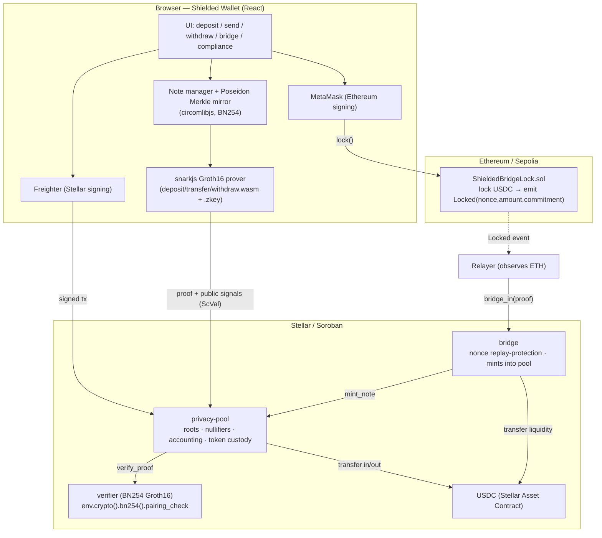
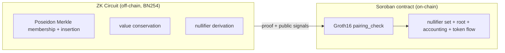

# ShieldedBridge — Architecture

## System overview



## Note scheme (UTXO model, Moonlight-inspired)

A **note** is `(amount, sk, blinding)`, owned by spend key `sk`:

```
pk         = Poseidon(sk)
commitment = Poseidon(amount, pk, blinding)        # stored in the tree (public)
nullifier  = Poseidon(commitment, sk)              # revealed on spend (unlinkable)
```

Only `commitment`s ever enter the Merkle tree; spends publish only the
`nullifier`. The on-chain nullifier set guarantees each note is spent at most once.

## Trust boundary — the contract does no hashing



All Poseidon / Merkle computation is proven inside the circuit; the contract only
verifies the proof and updates bookkeeping. This keeps the contract cheap and
removes any need for on-chain hashing of the tree.

## Public-signal layouts (contract ⇄ circuit contract)

| Op | Public signals (in order) |
|----|---------------------------|
| `deposit` / `bridge` | `[old_root, new_root, commitment, amount]` |
| `transfer` | `[old_root, new_root, nullifier_a, nullifier_b, out_cmt_a, out_cmt_b]` |
| `withdraw` | `[old_root, new_root, nullifier, change_commitment, amount, recipient_field]` |

The contract builds these `Vec<Fr>` from its typed arguments in exactly this order
and passes them to the verifier; the circuit declares the same public inputs.

## Deposit / transfer / withdraw flow

```mermaid
sequenceDiagram
  participant U as User (browser)
  participant T as Tree mirror
  participant P as snarkjs
  participant Pool as privacy-pool
  participant Ver as verifier

  U->>T: read current_root (sim) + build witness (paths, new_root)
  U->>P: fullProve(circuit, witness)
  P-->>U: proof + public signals
  U->>Pool: invoke(op, args, proof)  [Freighter-signed]
  Pool->>Pool: require old_root == current_root; nullifier unspent
  Pool->>Ver: verify_proof(vk, proof, signals)
  Ver-->>Pool: true
  Pool->>Pool: mark nullifier(s); current_root = new_root; move tokens
  Pool-->>U: success (event emitted)
```

## Bridge flow (ETH → Stellar)

```mermaid
sequenceDiagram
  participant U as User
  participant L as Lock (Sepolia)
  participant R as Relayer
  participant B as bridge (Soroban)
  participant Pool as privacy-pool

  U->>L: lock(amount, commitment)  [MetaMask]
  L-->>R: Locked(nonce, amount, commitment)
  R->>B: bridge_in(nonce, amount, commitment, old_root, new_root, proof)
  B->>B: require nonce unused; mark nonce
  B->>Pool: transfer liquidity in, then mint_note(proof)
  Pool->>Pool: verify proof; insert commitment; +shielded supply
```

The bridge holds Stellar-side liquidity equal to what's locked on Ethereum, so the
shielded supply stays fully backed. Replacing the relayer with a trustless
Ethereum state proof (verified by the same Groth16 path) is the upgrade to a fully
trustless bridge and leaves the `bridge_in` interface unchanged.

## Compliance — selective disclosure

Privacy ≠ opacity. A note holder can hand an auditor a **viewing key** that
reveals their own notes (proof-of-funds / source-of-funds) without exposing spend
authority or deanonymizing the rest of the pool — the ASP-style model from
Nethermind's design. The contract layer is unaffected; disclosure is a client
capability.
