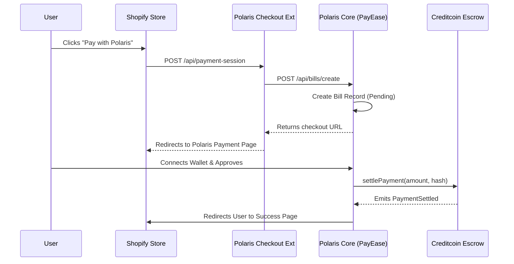

# 🌌 Polaris Core

Polaris Core is the heartbeat of the Polaris Protocol, providing the essential infrastructure for decentralized lending, private swaps, and institutional-grade AMM pools. It serves as the primary application layer for users to interact with the protocol's liquidity and privacy features.

## 🚀 Deployed Contracts (Ethereum Sepolia - Active)

Official smart contract registry deployed on Ethereum Sepolia (Chain ID: 11155111).

### 🏦 Mock Tokens
| Token | Address |
|-------|---------|
| **WETH** | `0xaf4D66F3f9D6325fd08ef6174949376702b76431` |
| **BNB**  | `0xEB5c6F2094cEDafcC9dBba249f43BacacFb085CA` |
| **USDC** | `0x209e6F4c016245833DE2999E170eb14F07C29BB1` |
| **USDT** | `0x010453c439A7a91e372AA256b7B6F65f59E7F44C` |

### 📈 Lending Pools
| Token | Address | Collateral Ratio | Interest Rate |
|-------|---------|------------------|---------------|
| **WETH** | `0x1291Be112d480055DaFd8a610b7d1e203891C274` | 150% | 5% APR |
| **BNB**  | `0x5f3f1dBD7B74C6B46e8c44f98792A1dAf8d69154` | 150% | 5% APR |
| **USDC** | `0xb7278A61aa25c888815aFC32Ad3cC52fF24fE575` | 120% | 3% APR |
| **USDT** | `0xCD8a1C3ba11CF5ECfa6267617243239504a98d90` | 120% | 3% APR |

### 🔐 Private Swap & FHEVM Vaults
| Contract Name | Address |
|-------|---------|
| **PrivateCollateralVault** | `0xb189E42714bBc63f1767093292605F52fD29bAb6` |
| **PrivateBorrowManager** | `0xb581Dbee8300631680f9819d80F28aa1771F6B4C` |
| **PrivateLendingPool** | `0x1b118B4a941dF9c73047CACE70D685B25ABd8084` |
| **PrivateLiquidationEngine** | `0x2a3ce934580d924cd8AC145aE9142019150a8Ead` |
| **PrivateSwapUSDC** | `0x772C9513fFcffaed224048b3e22AcF9E58854b73` |
| **PrivateSwapUSDT** | `0x066240CB1BEB2e83b74fAF198D9918fC2929b65f` |
| **PrivateSwapWETH** | `0xa307d16DFea8D265d5D6aE441b5E463Ad6B28e01` |
| **PrivateSwapBNB** | `0x17761eDa4f670baf6CC3DE099e30f61658a78241` |

### 🌊 AMM Pools
| Pair | Address |
|------|---------|
| **BNB-USDC** | `0xc351628EB244ec633d5f21fBD6621e1a683B1181` |
| **BNB-USDT** | `0xFD471836031dc5108809D173A067e8486B9047A3` |
| **WETH-USDC** | `0x51A1ceB83B83F1985a81C295d1fF28Afef186E02` |
| **WETH-USDT** | `0x36b58F5C1969B7b6591D752ea6F5486D069010AB` |

---

## 🏗️ Architecture Everything

The Polaris Protocol is designed with a modular, scalable architecture consisting of four primary layers:

### 1. Smart Contract Layer (`polaris-protocol`)
- **Core Engine**: `LoanEngine.sol` and `PoolManager.sol` manage current state and transactions.
- **Privacy Engine**: Integrated FHEVM (Fully Homomorphic Encryption) for private transactions.
- **Asset Hub**: `LiquidityVault.sol` manages deposits and cross-chain oracle interfaces (anchored via Creditcoin).

### 2. Real-Time Data Layer (Convex & Supabase)
- **Convex**: Handles real-time transaction tracking and global protocol state indexing.
- **Supabase**: Primary database for user settings, merchant profiles, and historical analytics.

### 3. Application Layer (`polaris-core`)
- **Next.js 14**: Modern App-router based frontend using Server Components for performance.
- **Hook-Driven**: custom React hooks in `hooks/` interface with both smart contracts and the real-time data layer.
- **Theming**: Premium dark-mode aesthetics using TailwindCSS and Framer Motion.

---

## 🔄 Core Workflows

### 🛡️ Cross-Chain Bridge Flow
1.  **Source Chain (Sepolia)**: User calls `deposit(token, amount)` on `LiquidityVault`.
2.  **Relayer**: Detects event, submits proof to **Creditcoin Oracle**.
3.  **Oracle**: Verifies finality and returns a `queryId`.
4.  **Master Hub (USC Testnet)**: User/Relayer calls `addLiquidityFromProof(queryId)` to update global state.

### 💳 Payment Gateway Flow (Shopify Integration)


---

## 🛠️ Development & Setup

### Requirements
- Node.js >= 18
- pnpm / npm
- Local Hardhat node running (from `polaris-protocol`)

### Installation
```bash
pnpm install
```

### Run Locally
```bash
npm run dev
```

---

## 📊 Directory Structure
- `app/`: Next.js pages and layouts.
- `components/`: Reusable UI components.
- `hooks/`: Blockchain and data fetching hooks.
- `lib/`: Utility functions and shared logic.
- `convex/`: Real-time backend functions.
- `public/`: Static assets.
