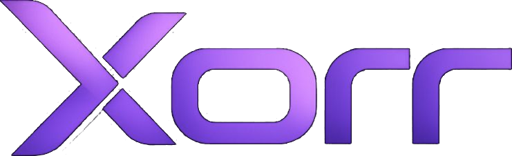

<p align="center">
  
</p>

<h3 align="center">XORR — landing page</h3>

<p align="center">
  The marketing site for <b>XORR</b>, a private-by-default money app on Stellar:<br/>
  shielded USDC, a ZK ETH↔Stellar bridge, a money market, and a real SEP-24 off-ramp.
</p>

<p align="center">
  
  
  
  
</p>

---

A dark, animated single-page site. Highlights:

- **Mega-menu navbar** — animated product/resources/tokens dropdowns with a sliding highlight (Framer Motion `layoutId`).
- **Hero + announcement** — the pitch, with motion-in reveals.
- **Bento feature grid** — Pay, Deposit, Earn & Borrow, Bridge, each with its own accent.
- **Token banner, partners, follow-along & CTA** sections, and a footer.
- **Smooth scrolling** via [Lenis](https://github.com/darkroomengineering/lenis).

## Run it

```bash
npm install
npm run dev      # http://localhost:3000
```

```bash
npm run build && npm run start   # production
```

## Stack

Next.js 15 (App Router) · React 19 · Tailwind CSS v4 · Framer Motion 12.41.0 · Lenis · lucide-react.

> Note: this pins **framer-motion 12.41.0** deliberately — 12.42.0 freezes SSR'd `initial` animations under React 19.

## Links

- **App:** [xorr-zk-stellar](https://github.com/nickthelegend/xorr-zk-stellar) (the full monorepo — wallet, contracts, circuits)
- **Contracts:** [xorr-zk-contracts](https://github.com/nickthelegend/xorr-zk-contracts)

External links (docs, app, GitHub) are configured in [`lib/links.ts`](./lib/links.ts).

---

_Stellar · testnet · not audited._
